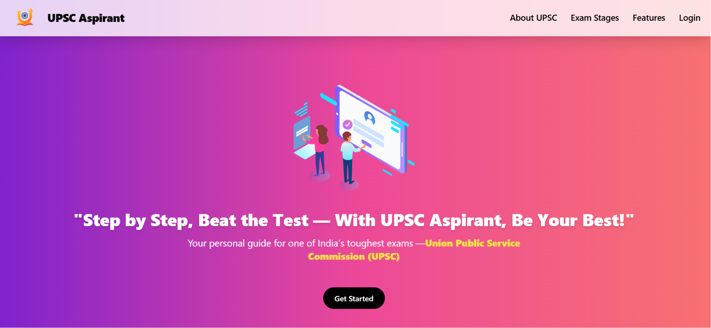
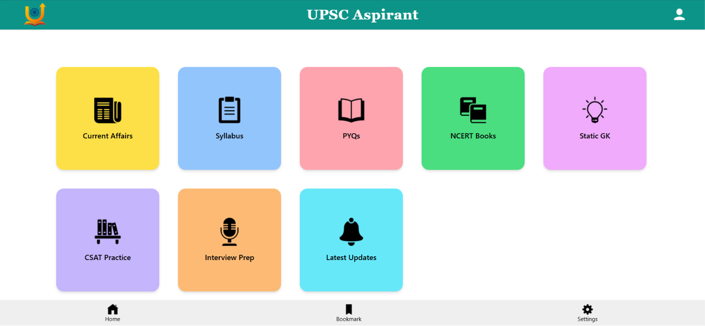
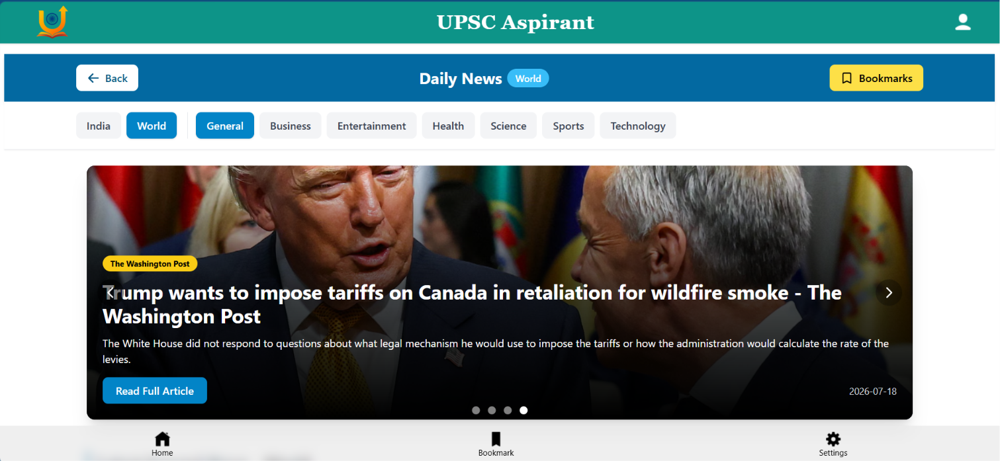

# 📚 UPSC Aspirant App

> **A one-stop platform designed to simplify UPSC preparation by bringing essential study resources, current affairs, PYQs, interview guidance, and official updates together in one place.**

---

## 🚀 About the Project

The **UPSC Aspirant App** was developed as my **Minor Project** during my **Diploma in Computer Science & Engineering**.

The idea behind this project came from observing that UPSC aspirants often rely on multiple websites and platforms to access study materials, current affairs, previous year papers, and exam updates. Managing resources from different sources can be time-consuming and inefficient.

To solve this problem, I built a centralized platform that provides all the essential resources in one clean and user-friendly interface, helping aspirants prepare smarter and stay organized.

---

## ✨ Key Features

- 📰 Daily Current Affairs with category-wise filtering and bookmarks
- 📘 NCERT Books & UPSC Syllabus
- 📄 Previous Year Question Papers (PYQs)
- 🌍 Static General Knowledge Notes
- 🧮 Topic-wise CSAT Study Material
- 🎥 Interview Preparation (DAF Tips, FAQs & Expert Videos)
- 🔔 Latest UPSC Notifications & Updates
- 🔐 Secure Admin Panel for Content Management and Login Analytics

---

## 🛠 Tech Stack

**Frontend**
- HTML5
- Tailwind CSS
- JavaScript

**Backend**
- Flask (Python)

**Database**
- MySQL
- JSON Files

---

## 🎯 Project Highlights

- Responsive and user-friendly interface
- Centralized UPSC study resources
- Secure admin dashboard
- Dynamic content management
- Database integration using MySQL
- Real-world full-stack web development project

---

## 📚 What I Learned

Through this project, I gained practical experience in:

- Full-Stack Web Development
- Flask Framework
- MySQL Database Management
- CRUD Operations
- Authentication
- JSON Data Handling
- Responsive UI Design
- Git & GitHub Version Control
- Problem Solving and Debugging

---

## 📸 Screenshots

- Landing page

- Dashboard Page

- Current Affairs Page

---

## 🚀 Future Enhancements

- User Authentication
- Mock Tests & Quiz Section
- AI-powered Study Assistant
- Progress Tracking Dashboard
- Mobile Application
- Dark Mode

---

## 👨‍💻 Developer

**Yashasvi Choudhary**

Diploma in Computer Science & Engineering

Aspiring Software Engineer | Full-Stack Developer | AI Enthusiast

---

⭐ **If you found this project helpful, consider giving it a Star on GitHub!**